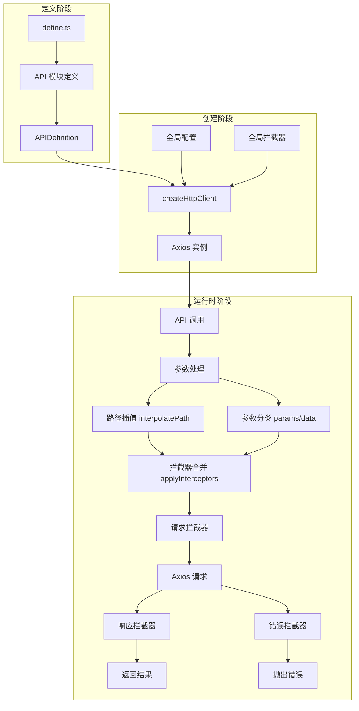
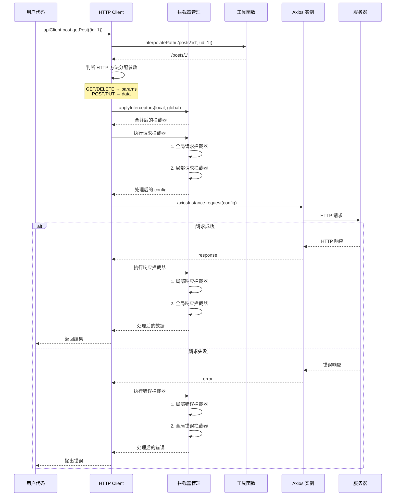
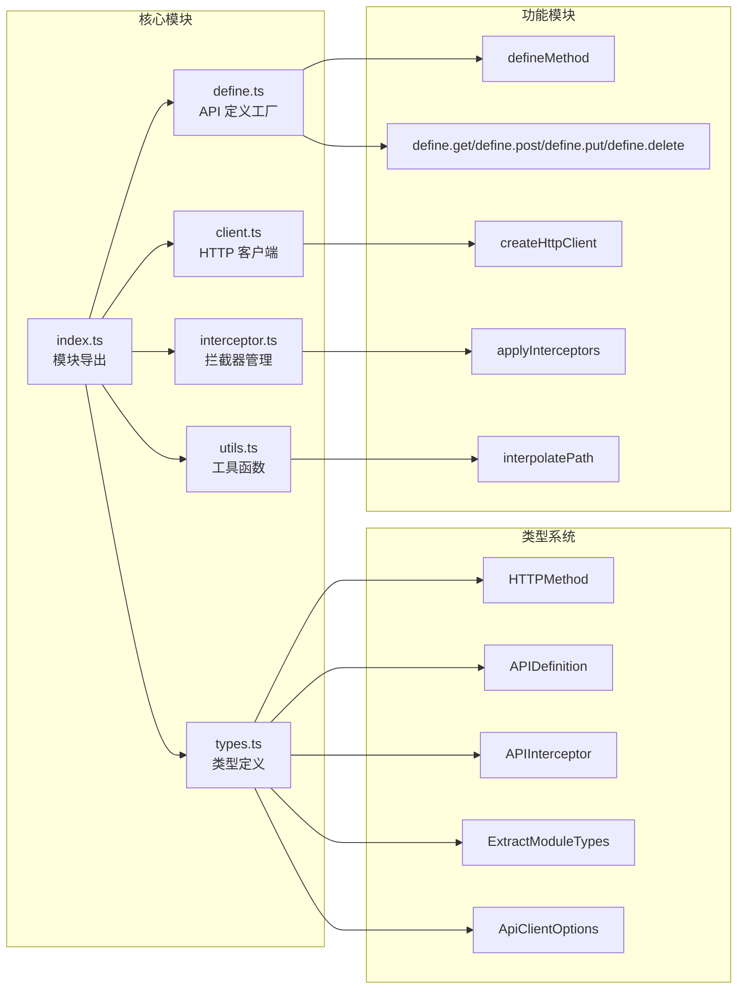
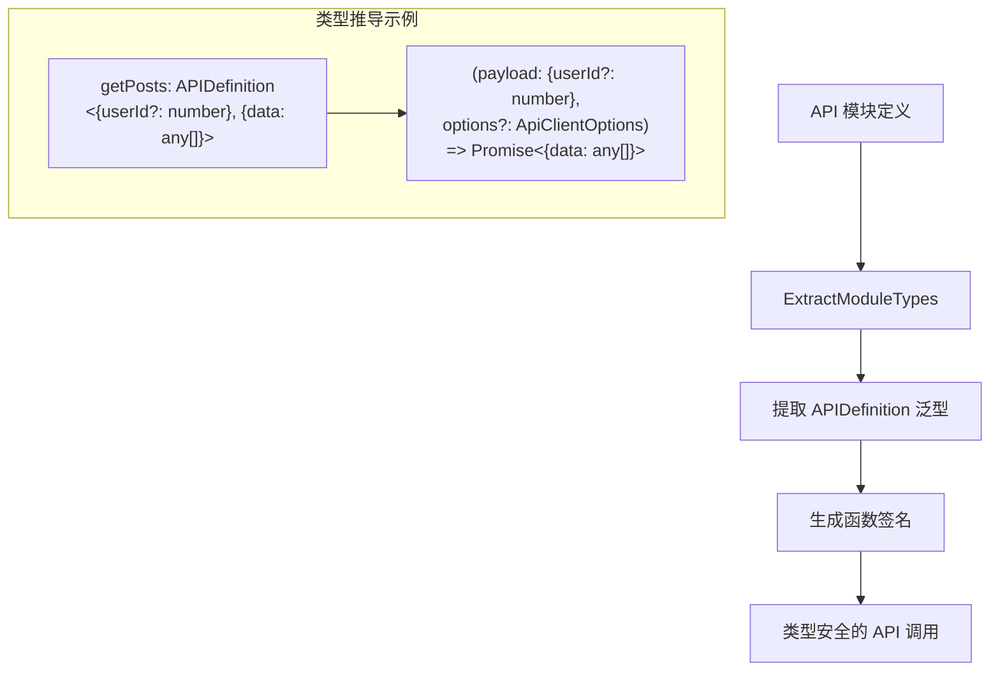

# request

一个基于 Axios 构建的类型安全、模块化的 HTTP 客户端。

## 特性

- **类型安全**: 利用 TypeScript 泛型，为每个 API 的请求和响应提供完整的类型定义。
- **模块化**: 将相关的 API 定义组织到模块中，使代码结构更清晰。
- **基于 Axios**: 底层使用 Axios，继承其所有强大功能，并允许传入自定义的 Axios 配置。
- **拦截器**: 支持全局拦截器和单个 API 定义级别的拦截器，方便统一处理认证、日志和错误。
- **智能参数处理**:
  - 自动将路径中的参数（如 `/users/:id`）替换为载荷中的对应值。
  - 根据 HTTP 方法自动判断将载荷作为查询参数 (`GET`, `DELETE`) 还是请求体 (`POST`, `PUT`)。


## 架构流程图

### 整体架构



### 请求处理流程



### 模块结构图



### 类型推导流程




## 使用方法

使用该库分为三个主要步骤：定义 API 模块、创建客户端实例、以及调用 API。

### 步骤 1: 定义 API 模块

使用 `define` 对象来定义你的 API 端点。每个定义包含 **HTTP 方法**、**路径**，以及可选的 **请求/响应类型** 和 **配置**。

你可以将一组相关的 API 定义组织成一个模块。

`apis/post.ts`:

```typescript
import { define } from '@qlj/request'

// 定义 Post 相关的 API 模块
export const postModule = {
  // 获取文章列表
  // 请求类型: { userId?: number, page?: number }
  // 响应类型: { data: any[] }
  getPosts: define.get<{ userId?: number, page?: number }, { data: any[] }>('/posts'),

  // 创建新文章
  // 可以在单个 API 定义中添加拦截器
  createPost: define.post<{ title: string, content: string }, { id: number }>('/posts', {
    interceptors: {
      request: (config) => {
        // 在发送请求前，为 data 添加一个创建时间
        config.data.createdAt = new Date().toISOString()
        return config
      },
    },
  }),

  // 获取单篇文章，路径中包含参数 :id
  getPost: define.get<{ id: number }, any>('/posts/:id'),

  // 更新文章
  updatePost: define.put<{ id: number, title?: string, content?: string }, { success: boolean }>('/posts/:id'),

  // 删除文章
  deletePost: define.delete<{ id: number }, { success: boolean }>('/posts/:id'),
}
```

### 步骤 2: 创建 HTTP 客户端

使用 `createHttpClient` 函数，传入定义好的模块和全局配置来创建一个客户端实例。

`services/apiClient.ts`:

```typescript
import { createHttpClient } from '@qlj/request'
import { postModule } from './apis/post'

export const apiClient = createHttpClient({
  // 注册模块
  modules: {
    post: postModule,
    // user: userModule, // 可以添加更多模块
  },
  // 全局 Axios 配置
  config: {
    baseURL: 'https://api.example.com',
    timeout: 5000,
    headers: {
      'Content-Type': 'application/json',
    },
    // 全局拦截器
    interceptors: {
      request: (config) => {
        // 可以在这里统一添加认证头等逻辑
        // const token = localStorage.getItem('token')
        // if (token) {
        //   config.headers.Authorization = `Bearer ${token}`
        // }
        return config
      },
      response: (res) => {
        // 全局响应处理
        console.log('Global response interceptor:', res)
        return res.data // 通常我们关心的是 res.data
      },
      error: (err) => {
        // 全局错误处理
        console.error('Global error interceptor:', err)
        throw err
      },
    },
  },
})
```

### 步骤 3: 发起 API 调用

现在你可以通过创建的 `apiClient` 来调用你的 API。客户端是完全类型安全的，TypeScript 会为你提供自动补全和类型检查。

```typescript
import { apiClient } from './services/apiClient'

async function fetchData() {
  try {
    // 获取文章列表 (GET /posts?userId=1)
    const posts = await apiClient.post.getPosts({ userId: 1 })
    console.log('Posts:', posts)
    // => posts 的类型是 { data: any[] }

    // 创建一篇文章 (POST /posts)
    const newPost = await apiClient.post.createPost({
      title: 'My New Post',
      content: 'This is the content.',
    })
    console.log('New Post ID:', newPost.id)
    // => newPost 的类型是 { id: number }

    // 获取一篇文章 (GET /posts/1)
    const post = await apiClient.post.getPost({ id: 1 })
    console.log('Post with ID 1:', post)
  }
  catch (error) {
    console.error('Failed to fetch data:', error)
  }
}

fetchData()
```

## 高级用法

### 自定义请求配置

每个 API 调用都可以接受第二个可选参数，用于传入自定义的 Axios 配置。这些配置会与全局配置合并，但优先级更高。

```typescript
// 1. 自定义超时和响应类型
const data = await apiClient.post.getPosts(
  { userId: 1 },
  {
    timeout: 10000, // 覆盖全局超时设置
    responseType: 'json',
  }
)

// 2. 文件上传进度监控
const formData = new FormData()
formData.append('file', fileBlob)
const uploadResult = await apiClient.post.uploadFile(
  { file: formData },
  {
    headers: { 'Content-Type': 'multipart/form-data' },
    onUploadProgress: (progressEvent) => {
      const percentCompleted = Math.round((progressEvent.loaded * 100) / progressEvent.total)
      console.log(`上传进度: ${percentCompleted}%`)
    },
  }
)

// 3. 请求取消
const controller = new AbortController()
try {
  const result = await apiClient.post.getLongOperation(
    { taskId: 123 },
    { signal: controller.signal }
  )
}
catch (error) {
  if (error.name === 'CanceledError') {
    console.log('请求已取消')
  }
}
// 在需要时取消请求
controller.abort()

// 4. 自定义响应数据转换
const transformedData = await apiClient.post.getRawData(
  { type: 'stats' },
  {
    transformResponse: [(data) => {
      // 自定义数据转换逻辑
      const parsed = typeof data === 'string' ? JSON.parse(data) : data
      return {
        ...parsed,
        timestamp: Date.now(),
        values: parsed.values.map(Number),
      }
    }],
  }
)

// 5. 自定义验证状态
const response = await apiClient.post.getWithCustomStatus(
  { id: 123 },
  {
    validateStatus: (status) => {
      // 自定义哪些 HTTP 状态码应该被视为成功
      return status >= 200 && status < 300 || status === 304
    },
  }
)

// 6. 请求重试和重定向
const result = await apiClient.post.getWithRetry(
  { id: 456 },
  {
    maxRedirects: 5, // 最大重定向次数
    timeout: 3000, // 每次请求的超时时间
  }
)

// 7. 自定义序列化
const searchResult = await apiClient.post.search(
  { filters: { date: new Date(), tags: ['a', 'b'] } },
  {
    paramsSerializer: (params) => {
      // 自定义参数序列化
      return Object.entries(params)
        .map(([key, value]) => {
          if (value instanceof Date) {
            return `${key}=${value.toISOString()}`
          }
          if (Array.isArray(value)) {
            return `${key}=${value.join(',')}`
          }
          return `${key}=${value}`
        })
        .join('&')
    },
  }
)

// 8. 响应类型处理
const textResponse = await apiClient.post.getTextContent(
  { docId: 789 },
  { responseType: 'text' }
)

const blobResponse = await apiClient.post.downloadFile(
  { fileId: 'abc' },
  {
    responseType: 'blob',
    onDownloadProgress: (progressEvent) => {
      const percentCompleted = Math.round((progressEvent.loaded * 100) / progressEvent.total)
      console.log(`下载进度: ${percentCompleted}%`)
    },
  }
)
```

### 类型说明

`ApiClientOptions` 类型继承自 `AxiosRequestConfig`，但排除了一些在模块定义时已经确定的字段：

```typescript
type ApiClientOptions = Omit<AxiosRequestConfig, 'url' | 'method' | 'data' | 'params'>
```

这意味着你可以使用 Axios 支持的所有配置选项，除了：

- `url`: 在 API 定义中通过 `path` 指定
- `method`: 在 API 定义中通过 `method` 指定
- `data`: 通过调用时的第一个参数传入
- `params`: 通过调用时的第一个参数传入

常用的配置选项包括：

- `timeout`: 请求超时时间（毫秒）
- `headers`: 自定义请求头
- `responseType`: 响应数据类型（'json' | 'text' | 'blob' | 'arraybuffer'）
- `signal`: AbortController 的信号，用于取消请求
- `onUploadProgress`: 上传进度回调
- `onDownloadProgress`: 下载进度回调
- `transformResponse`: 响应数据转换函数
- `validateStatus`: 自定义哪些 HTTP 状态码应该被视为成功
- `maxRedirects`: 最大重定向次数
- `paramsSerializer`: 自定义参数序列化函数


## TODO

[ ] 支持 params 与 data 混用
[ ] 基于 proxy 重写 client 的实现
[ ] 优化拦截器